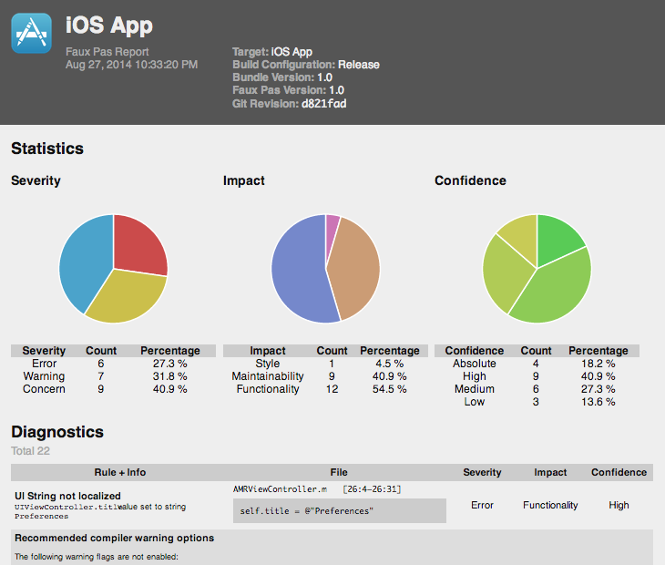

Faux Pas Diagnostics Presenter
==============================

This is a standalone client-side web app for presenting diagnostics emitted by [Faux Pas].

[Faux Pas]: http://fauxpasapp.com

Try it out
----------

Run the following in the root folder of this repository:

    python -m SimpleHTTPServer

Then open the following URL in a browser:

    http://localhost:8000/app/?json=../example.json

Installation
------------

Simply have a web server serve the static files in the `app` folder.

You can then load up `index.html` in a web browser, and specify the URL where to load the diagnostics set JSON produced by Faux Pas.
